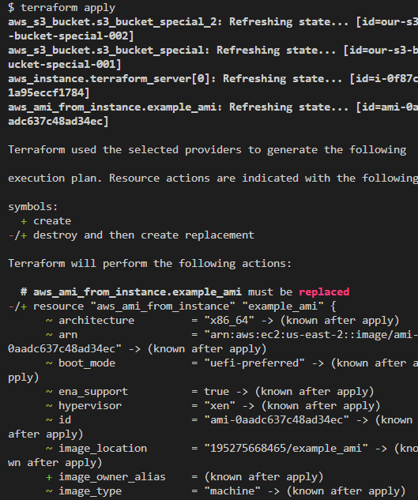
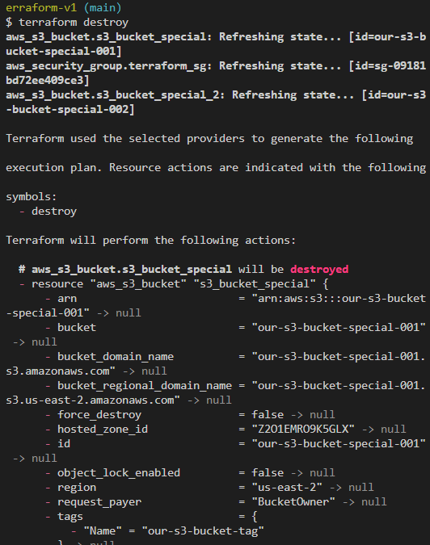
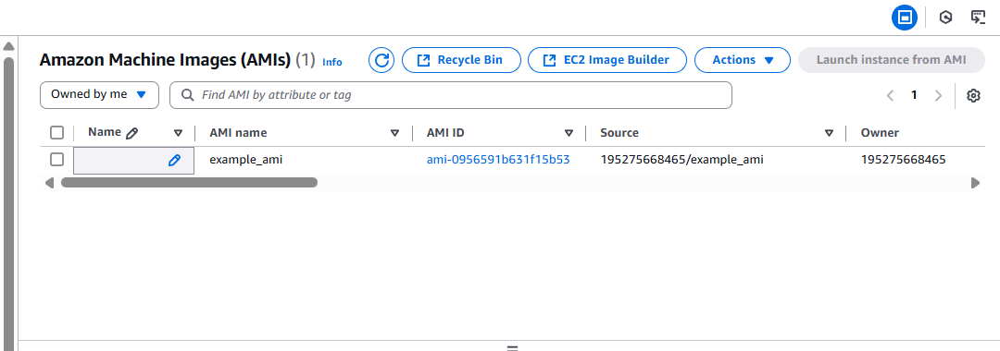

# Terraform EC2 and S3 Configuration

This document provides a step-by-step guide to the process of setting up AWS resources using Terraform. The tasks include the creation of EC2 instances, custom AMI generation, and S3 bucket creation.

## Table of Contents

- [Terraform EC2 and S3 Configuration](#terraform-ec2-and-s3-configuration)
  - [Table of Contents](#table-of-contents)
  - [Introduction](#introduction)
  - [AWS CLI Setup \& Authentication](#aws-cli-setup--authentication)
    - [Commands:](#commands)
  - [Task 1: EC2 Instance Creation](#task-1-ec2-instance-creation)
    - [Steps:](#steps)
  - [Terraform Execution](#terraform-execution)
    - [Commands Run:](#commands-run)
    - [Evidence:](#evidence)
  - [Resource Verification](#resource-verification)
    - [EC2 Instance (AWS Console):](#ec2-instance-aws-console)
  - [Task 2: AMI Creation](#task-2-ami-creation)
    - [Steps:](#steps-1)
    - [Commands Run:](#commands-run-1)
  - [Resource Verification](#resource-verification-1)
    - [AMI (AWS Console):](#ami-aws-console)
    - [Steps:](#steps-2)
    - [Commands Run:](#commands-run-2)
  - [Resource Verification](#resource-verification-2)
    - [S3 Buckets:](#s3-buckets)
  - [Task 3: S3 Bucket Creation](#task-3-s3-bucket-creation)
  - [Cleanup](#cleanup)
    - [Command:](#command)
    - [Evidence:](#evidence-1)
  - [Conclusion](#conclusion)

## Introduction

In this project, we have used Terraform to automate the provisioning of several AWS resources. The tasks include creating EC2 instances, generating an AMI from the EC2 instance, and setting up S3 buckets. We also used Terraform provisioners to automate the installation of packages (Apache) on the EC2 instance.

## AWS CLI Setup & Authentication

Before using Terraform, the AWS CLI was installed and configured for authentication.

### Commands:
```bash
aws --version
aws configure
aws sts get-caller-identity
```
## Task 1: EC2 Instance Creation

### Steps:
1. **Create a new directory** for the Terraform project.
2. **Initialize Terraform** with the following command:
    ```bash
    terraform init
    ```
3. **Define provider and instance configuration**:
    - We configured the AWS provider and created an EC2 instance using the following code in the `ec2.tf` file:
      ```hcl
      resource "aws_instance" "terraform_server" {
        ami           = "ami-04f167a56786e4b09"
        instance_type = "t2.micro"
        count         = 1
        key_name      = "terraform"
        
        provisioner "remote-exec" {
          inline = [
            "sudo apt update -y",
            "sudo apt install -y apache2"
          ]
          
          connection {
            type        = "ssh"
            user        = "ubuntu"
            private_key = file("C:/Users/Owner/Downloads/terraform.pem")  # Adjust path as needed
            host        = self.public_ip
          }
        }

        tags = {
          Name = "MyTerraformInstance"
        }
      }
      ```
    - The instance is created with the **`t2.micro`** type, and the **`terraform`** key pair is used for SSH access.
    - The provisioner installs Apache automatically upon instance creation.

## Terraform Execution

Terraform commands used to provision infrastructure:


### Commands Run:
- Initialize Terraform:
    ```bash
    terraform init
    ```
- Plan the changes:
    ```bash
    terraform plan
    ```
- Apply the configuration:
    ```bash
    terraform apply
    ```
### Evidence:




## Resource Verification

### EC2 Instance (AWS Console):


## Task 2: AMI Creation

After the EC2 instance is created, we used **Terraform's `aws_ami_from_instance` resource** to create a custom Amazon Machine Image (AMI) from the instance.

### Steps:
1. **Update the `ec2.tf` file** to include the `aws_ami_from_instance` resource:
    ```hcl
    resource "aws_ami_from_instance" "example_ami" {
      name                 = "example_ami"
      source_instance_id   = aws_instance.terraform_server.id
      description          = "AMI created for my Terraform instance"
    }
    ```
2. This AMI allows us to create instances with the same setup (Apache installed).

### Commands Run:
- Apply the configuration to create the AMI:
    ```bash
    terraform apply
    ```

## Resource Verification

### AMI (AWS Console):



We created two **S3 buckets** using Terraform to store data.

### Steps:
1. **Define S3 bucket resources** in the `s3.tf` file:
    ```hcl
    resource "aws_s3_bucket" "s3_bucket_special" {
      bucket = "our-s3-bucket-special-001"
      
      tags = {
        Name = "our-s3-bucket-tag"
      }
    }

    resource "aws_s3_bucket" "s3_bucket_special_2" {
      bucket = "our-s3-bucket-special-002"
      
      tags = {
        Name = "our-s3-bucket-tag"
      }
    }
    ```

    - These buckets are named **`our-s3-bucket-special-001`** and **`our-s3-bucket-special-002`**.
    - Tags are applied for identification.

### Commands Run:
- Apply the configuration to create the S3 buckets:
    ```bash
    terraform apply
    ```
## Resource Verification
### S3 Buckets:

## Task 3: S3 Bucket Creation

## Cleanup

After verifying the infrastructure, it was destroyed to avoid unnecessary charges.

### Command:
```bash
terraform destroy
```

### Evidence:


---
## Conclusion

We have successfully automated the process of creating an EC2 instance, creating an AMI, and setting up S3 buckets using Terraform. The key steps included:

1. **EC2 instance creation** with provisioners for package installation.
2. **AMI creation** from the EC2 instance.
3. **S3 bucket creation** to store data.

Although the project was structured using separate `ec2.tf` and `s3.tf` files instead of a single `main.tf`, the logic remains functionally equivalent and modular. The infrastructure was fully deployed, verified, and later destroyed as per best practices.

By following these steps, we can recreate the infrastructure on demand and automate tasks like software installation on EC2 instances. This setup is ideal for managing infrastructure in a scalable and repeatable manner.

